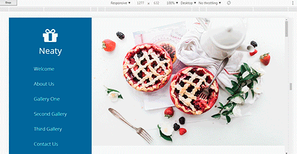

#   NEATY

##  Описание 
Верстка произведена css сеткой. Настройки сетки в файле flexbox-grid-less.less. Применены библиотеки jQuery для слайдеров fancybox.

Адаптивная верстка под мобильные экраны, планшеты и десктопы.

        В связи с тем что данная страница является шаблонам. Некоторые ссылки могут не работать.

##  Стек технологий примененный при разработке шаблона
*   ES5
*   jQuery
*   [flexbox-grid-less](https://github.com/victor8titov/flexbox-grid-less)
*   [fancybox](http://fancyapps.com/fancybox/3/)

##  Скриншоты шаблона
